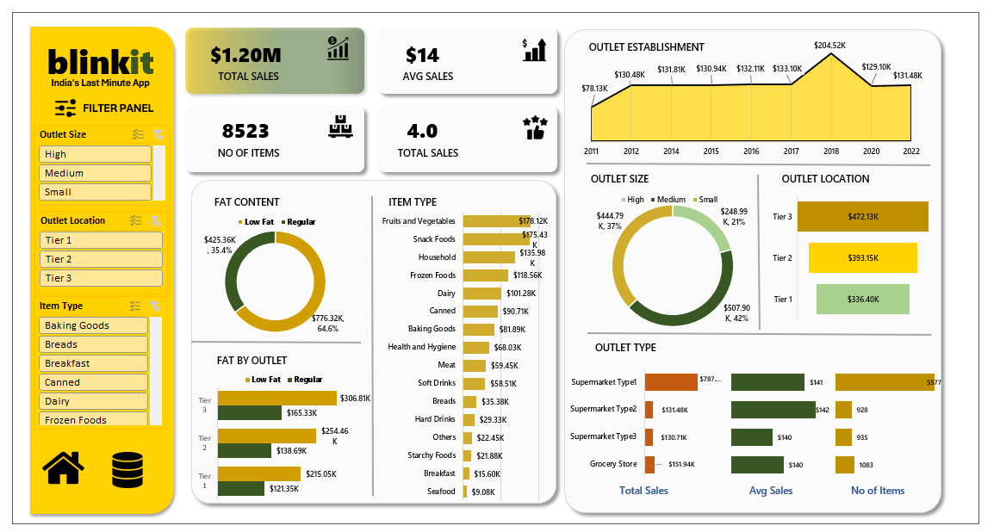
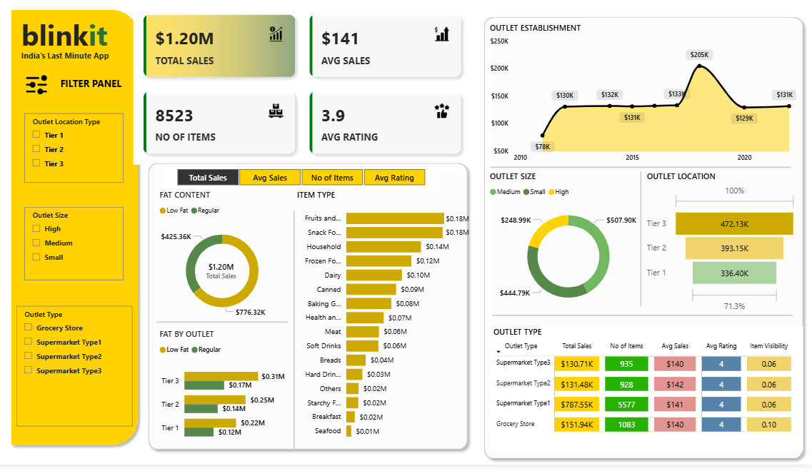

# 🛒 Blinkit Data Analysis (Excel and Power BI Dashboard)

A complete **Blinkit Sales Data Analysis Dashboard** built using **Excel** and **Power BI** to uncover key business insights like **sales performance, outlet trends, item performance, and customer ratings**.

This project helps in understanding which factors impact revenue and how Blinkit can improve decision making using data.

---

## 🚀 Project Overview
In this project, I analyzed Blinkit sales dataset and created an interactive dashboard to track:

✅ Total Sales & Average Sales  
✅ Number of Items sold  
✅ Customer Rating trends  
✅ Outlet type, size & location performance  
✅ Sales trends by categories and fat content  

---

## 🎯 Objectives
- Analyze Blinkit sales performance
- Find top performing outlets and item categories
- Identify customer rating patterns
- Discover trends that impact revenue growth
- Build an interactive Excel and Power BI Dashboard for decision making

---

## 📊 Key Insights Generated
- Total revenue trend and yearly growth
- Top selling product categories
- Outlet performance based on:
  - Outlet type
  - Outlet size
  - Outlet location
- Sales distribution by fat content
- Relationship between customer rating and sales

---

## 🧰 Tools & Technologies Used
- **Microsoft Excel** (Data Cleaning + Dashboard)
- **Power BI** (Interactive Dashboard + Insights)
- **Power Query**
- **DAX (Measures & Calculations)**
---

## 🧹 Data Cleaning & Transformation
Performed the following steps:
- Removed null / missing values
- Standardized category names
- Fixed wrong data types
- Created new columns and measures
- Built relationships between tables

---

## 📌 Dashboard Features
✅ KPI Cards (Total Sales, Avg Sales, Avg Rating, Items Count)  
✅ Filters (Outlet Size, Location Type, Item Type)  
✅ Trend Line for Sales  
✅ Category wise analysis  
✅ Outlet wise performance comparison  
✅ Interactive slicers for quick insights  

---

## 📷 Dashboard Preview

### Excel Dashboard


### Power BI Dashboard


## 📂 Project Structure

```bash
Blinkit-Data-Analysis/
│
├── Dataset/        # Raw dataset files
├── Dashboard/      # Excel (.xlsx ) file and Power BI (.pbix) file
├── Images/         # Dashboard images/screenshots
└── README.md       # Project documentation

## ✅ Conclusion
This Blinkit dashboard provides a clear view of sales performance and highlights improvement areas using data-driven insights.  
It can help businesses make better decisions on product strategy, outlet growth, and customer satisfaction.

---

## 🙋‍♀️ Author
**Shital Dubule**  
📌 Aspiring Data Analyst | Power BI | Python | SQL  

If you like this project ⭐ don’t forget to star the repo!
